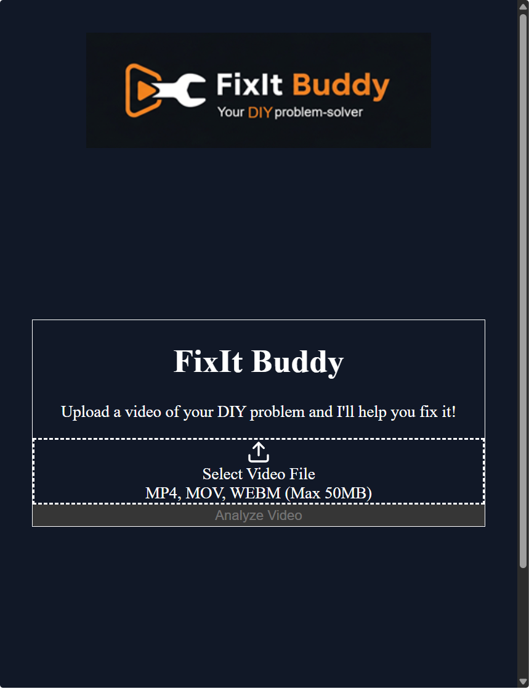
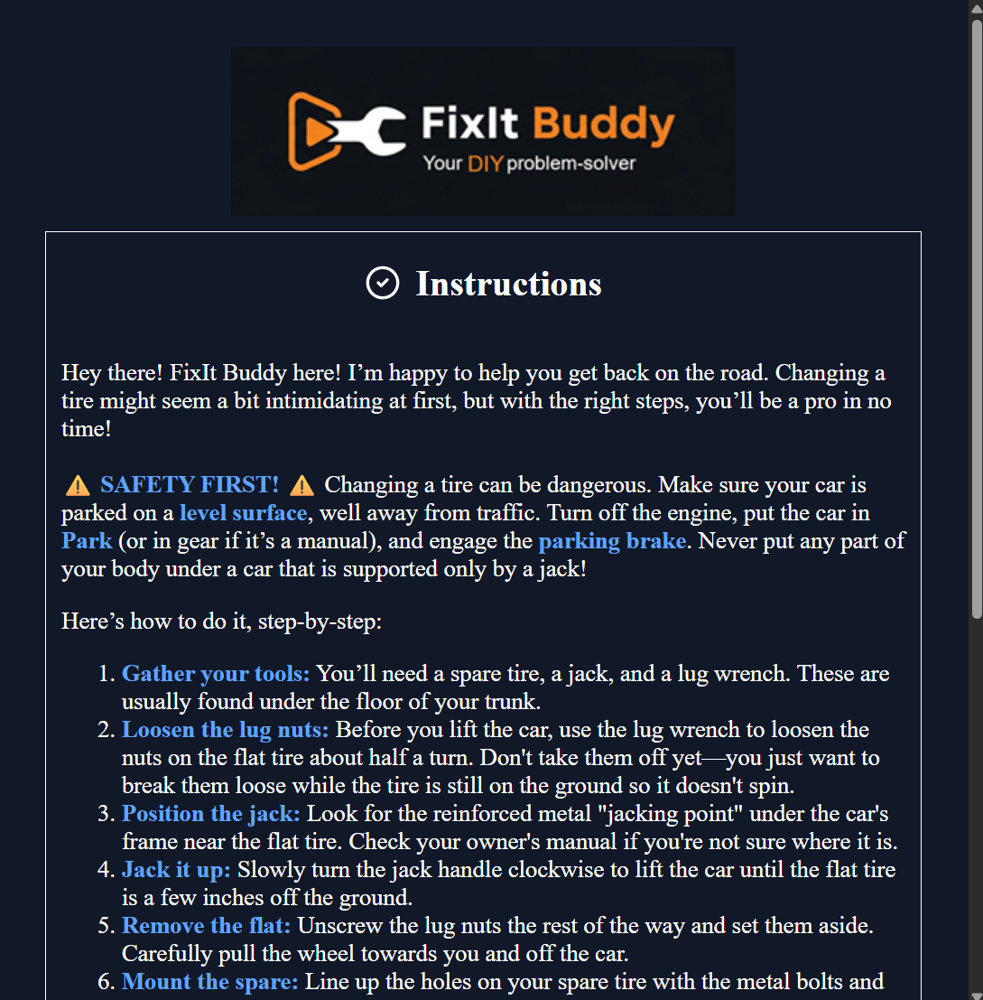

# FixIt Buddy
[](https://priset.ai)
[](https://youtu.be/jBKaNOHe42Y)
[](./LICENSE)


**Scafolded in 18-minutes**

A full-stack AI-powered DIY assistant that analyzes videos and provides step-by-step instructions.

This project was developed as a 'Glass Box' demonstration using [Priset](https://www.priset.ai/). All scaffolding and debugging were performed in a 18-minute collaborative session between a human director and the Gemini-powered Priset engine.

# Screenshots

<p align="left">
  
  
  
</p> 

## Project Structure

- `frontend/`: React + TypeScript + Tailwind CSS
- `backend/`: Node.js + Express + Google Gemini AI

## Prerequisites

- Node.js (v18+)
- Google Gemini API Key

## Setup

### Backend

1. Navigate to `backend/`
2. Rename the `.env.example` to `.env` and update your Gemini API key:
   ```
   PORT=5000
   GEMINI_API_KEY=your_api_key_here
   ```
3. Install dependencies:
   ```bash
   npm install
   ```
4. Start the server:
   ```bash
   node index.js
   ```

### Frontend

1. Navigate to `frontend/`
2. Install dependencies:
   ```bash
   npm install
   ```
3. Start the development server:
   ```bash
   npm run dev
   ```

## Usage

1. Open the frontend URL (usually `http://localhost:5173`).
2. Upload a video of a DIY task or problem.
3. Wait for FixIt Buddy to analyze and provide instructions.
